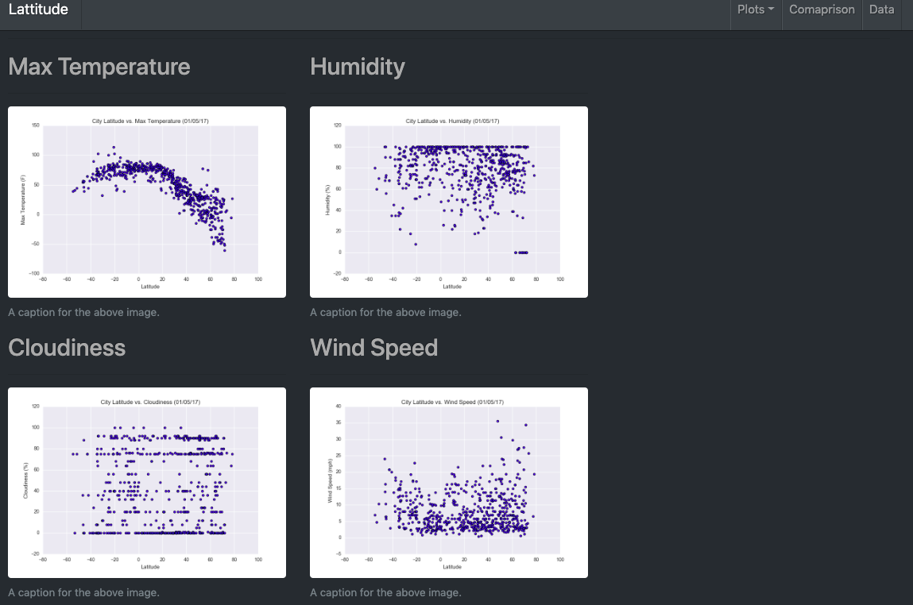

##  12. Web Visualization Dashboard (Latitude)

In order to deploy this project you must use http server or editor that has possibility to emulate server. It didn't work for me when I loaded it using the following pathway: /Users/user/Repos/USC-Bootcamp/11-Web/Homework/Resources/data-page.html), so I used an editor that created the server automatically. 

## Latitude - Latitude Analysis Dashboard with Attitude

Creating a visualization dashboard website using visualizations we've created in a past assignment. Specifically, we'll be plotting [weather data](Resources/cities.csv).
Create individual pages for each plot and a means by which we can navigate between them. These pages will contain the visualizations and their corresponding explanations. We'll also have a landing page, a page where we can see a comparison of all of the plots, and another page where we can view the data used to build them.

### Website Requirements

For reference, see the ["Screenshots" section](#screenshots) below.

The website must consist of 7 pages total, including:

* A [landing page](#landing-page) containing:
  * An explanation of the project.
  * Links to each visualizations page.
* Four [visualization pages](#visualization-pages), each with:
  * A descriptive title and heading tag.
  * The plot/visualization itself for the selected comparison.
  * A paragraph describing the plot and its significance.
* A ["Comparisons" page](#comparisons-page) that:
  * Contains all of the visualizations on the same page so we can easily visually compare them.
  * Uses a bootstrap grid for the visualizations.
    * The grid must be two visualizations across on screens medium and larger, and 1 across on extra-small and small screens.
* A ["Data" page](#data-page) that:
  * Displays a responsive table containing the data used in the visualizations.
    * The table must be a bootstrap table component.
    * The data must come from exporting the `.csv` file as HTML, or converting it to HTML. You may use a csv-to-html table conversion tool, e.g. [ConvertCSV](http://www.convertcsv.com/csv-to-html.htm).

The website must, at the top of every page, have a navigation menu that:

* Has the name of the site on the left of the nav which allows users to return to the landing page from any page.
* Contains a dropdown on the right of the navbar named "Plots" which provides links to each individual visualization page.
* Provides two more links on the right: "Comparisons" which links to the comparisons page, and "Data" which links to the data page.
* Is responsive (using media queries). The nav must have similar behavior as the screenshots ["Navigation Menu" section](#navigation-menu) (notice the background color change).

### Considerations

* You may use the [weather data](Resources/cities.csv) or choose another dataset. Alternatively, you may use the included [cities dataset](Resources/cities.csv) and pull the images from the [assets folder](Resources/assets).
* You must use bootstrap. This includes using the bootstrap `navbar` component for the header on every page, the bootstrap table component for the data page, and the bootstrap grid for responsiveness on the comparison page.
* You must deploy your website to GitHub pages, with the website working on a live, publicly accessible URL as a result.
* Be sure to use a CSS media query for the navigation menu.
* Be sure your website works at all window widths/sizes.
* Feel free to take some liberty in the visual aspects, but keep the core functionality the same.

### Bonuses

* Use a different dataset! The requirements above still hold, but make it your own.
* Use a bootstrap theme to customize your website. You may use a tool like [Bootswatch](https://bootswatch.com/). Make it look snazzy, give it some attitude. If using this, be sure you also meet all of the requirements listed above.
* Add extra visualizations! The more comparisons the better, right?
* Use meaningful glyphicons next to links in the header.
* Have visualization navigation on every visualizations page with an active state. See the screenshots below.

### Screenshot

